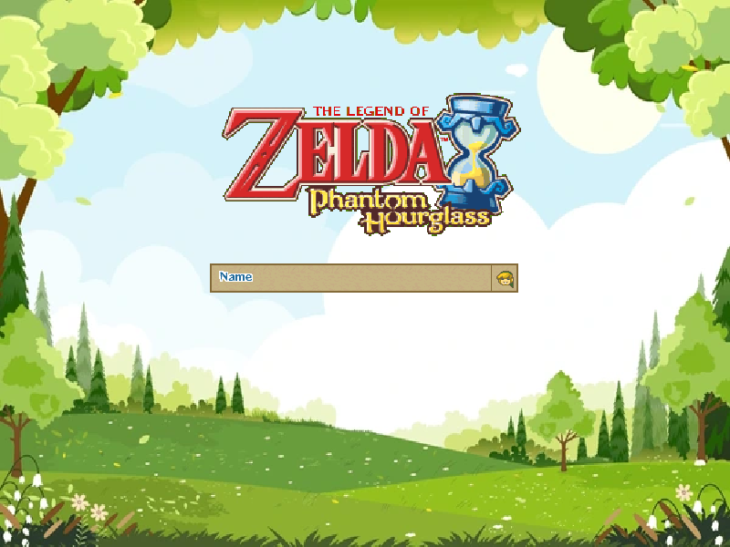
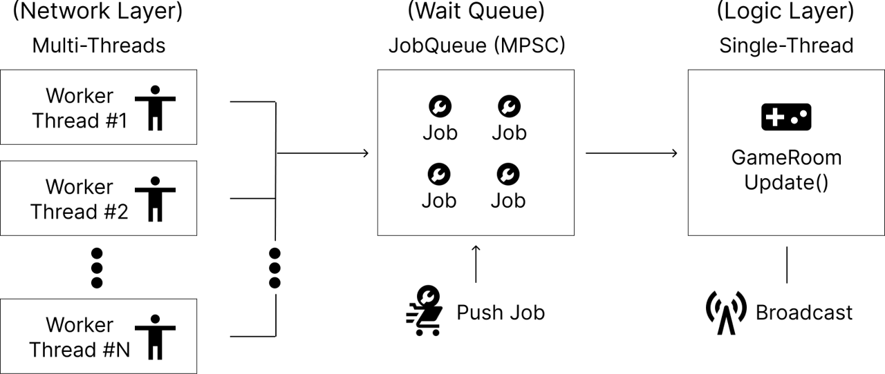
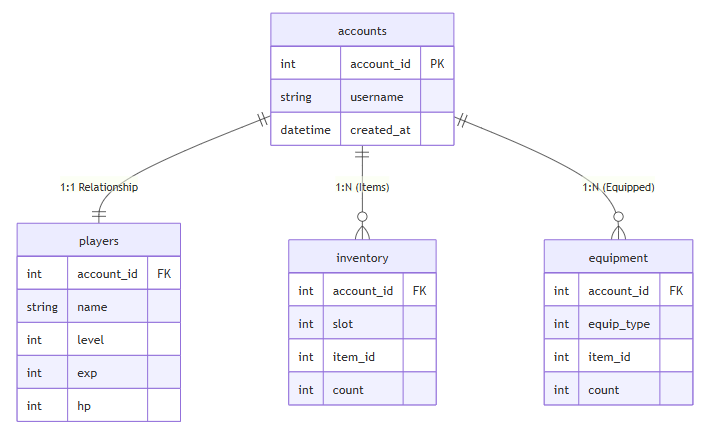
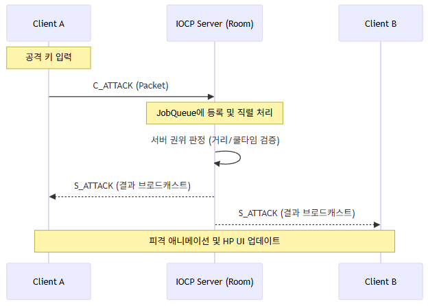

###### 26.02.10 프로젝트 스냅샷을 별도 브랜치로 남깁니다.
# 온라인 RPG 게임 (IOCP Server & WinAPI Client)

**WinAPI 클라이언트**와 **IOCP 기반 C++ 서버**를 직접 구현하여 구축한 서버 권위(Server-Authoritative) 구조의  RPG입니다.

<!-- 타이틀/플레이 이미지 -->


---

## 📺 프로젝트 시연 영상
[](https://youtu.be/wyDDfSWafTo)
###### *위 이미지를 클릭하면 유튜브 시연 영상으로 이동합니다.*

---

## 게임 개요 (Game Overview)

- **장르**: 2D 타일맵 온라인RPG
- **개발 인원**: 1인
- **기간**: 2025.12.18 ~ 2026.02.12 (8주)
- **목적**: IOCP 기반 게임 서버를 직접 구현해보며 온라인 게임에 필요한 게임 서버 구조를 학습

* **핵심 루프**: 로그인 ➔ 마을 접속 ➔ 파티 결성 ➔ 인스턴스 던전 입장 ➔ 몬스터 사냥 및 레벨업 ➔ 아이템 획득 및 장착.
* **성장 시스템**: 적 처치 시 경험치를 획득하여 레벨업하고 획득한 장비를 장착하여 캐릭터 스탯을 강화할 수 있습니다.
* **멀티플레이**: 룸 기반의 월드 관리로 수십 명의 플레이어가 동일한 공간에서 실시간으로 상호작용합니다.

---

## 시스템 아키텍처 (System Architecture)

### 1. 스레드 모델 및 동기화 (Multi-threaded JobQueue)

동시 접속 환경에서 네트워크 I/O를 처리하기 위해 **IOCP 모델**을 채택했으며, 로직 안정성을 위해 **JobQueue 기반의 직렬 처리 구조**를 설계했습니다.

* **IOCP Worker Threads**: `AcceptEx`와 `GQCS`를 통해 여러 개의 연결을 비동기로 처리하며 패킷을 수신합니다.
* **Game Logic Thread**: 네트워크 스레드와 게임 로직을 엄격히 분리하여, 각 룸의 `JobQueue`에 쌓인 작업을 단일 스레드에서 순차적으로 처리함으로써 룸 로직의 동시성 문제를 크게 완화했습니다.
* **실행 모드 분리**: `Server.exe`(single), `Server.exe multi [workerCount]`(multi) 형태로 모드를 분리해 동일 시나리오 성능 비교가 가능하도록 구성했습니다.



### 2. 월드 구성 및 인스턴스 시스템

* **Static Room (마을)**: 모든 유저가 접속하는 공용 공간으로 채널 시스템을 통해 인원을 분산 관리합니다.
* **Instance Room (던전)**: 파티의 입장 요청 시 동적으로 생성되는 독립 공간입니다. 던전 내 인원이 0명이 될 경우 자동으로 인스턴스를 제거하여 서버 자원을 최적화합니다.
* **데이터 주도 설계 (Data-Driven)**: `RoomConfig.csv`, `MonsterSpawn.json` 등을 통해 코드 수정 없이 스테이지 구성 및 몬스터 스폰 패턴을 확장할 수 있습니다.

---

## 멀티스레드 성능 실측 결과

DummyClient 100개를 동원하여 단일 스레드 대비 멀티스레드 서버의 처리량(Throughput)을 실측했습니다.
###### `docs/benchmarks/` 참고

### 실험 재현 조건
- Server 실행 모드:
  - Single: `Server.exe`
  - Multi: `Server.exe multi 8`
- DummyClient: 100 bots, move interval 120ms, attack interval 700ms
- 측정 시간: 180초
- 집계 기준: 안정구간(`S_EnterGame=0`) 평균
- 반복 횟수: Single 3회 / Multi 3회 평균

| 지표 (Packet/sec) | Single Thread | **Multi Thread** | **개선율** |
| --- | --- | --- | --- |
| **S_Move (이동)** | 112.37 | **388.98** | **+246.1%** |
| **S_Attack (공격)** | 110.69 | **260.42** | **+135.2%** |
| **S_Damaged (피격)** | 14.34 | **179.01** | **+1148.2%** |

* **해석**: 이번 측정에서는 멀티스레드 전환 후 **피격(Damaged) 지표가 Single 대비 약 11배 높게 관측**되었습니다.

---

### 데이터베이스 설계 (Database Design)

본 프로젝트는 별도 DB 서버 없이 실행 가능한 영속화 계층으로 **SQLite**를 사용했습니다. 로컬 개발/테스트 환경에서 설정 부담을 낮추고, 확장성을 고려해 정규화된 스키마를 구성했습니다.

#### 1. 논리적 데이터 구조 (ERD)

기존 DB의 실제 연결 관계와 논리적 흐름을 도식화했습니다.



#### 2. 데이터 영속화 및 최적화 전략

* **WAL(Write-Ahead Logging) 모드**: `PRAGMA journal_mode=WAL` 설정을 적용해 읽기와 쓰기 경합을 줄이는 방향으로 구성했습니다.
* **계정 중심 식별 구조**: 모든 테이블이 `account_id`를 외래 키(FK)로 참조하게 설계하여, 세션 종료 시 유저의 전체 상태(플레이어, 인벤토리, 장비)를 일관성 있게 일괄 저장합니다.
* **저장 시점**: DB 트랜잭션은 유저 접속 종료 시점 이벤트에서 수행됩니다.

---

## 주요 구현 포인트

### 1. 서버 권위(Server-Authoritative) 판정

* **전투 검증**: 클라이언트의 입력은 단순 제안으로 취급하며, 서버가 무기 타입(검/활/스태프)에 따른 사거리, 충돌, 데미지 판정을 최종 결정 후 브로드캐스트합니다.
* **AI 시뮬레이션**: 서버 사이드에서 A* 알고리즘을 수행하여 장애물을 회피하며 유저를 추적하는 몬스터 AI를 구현했습니다.



### 2. 클라이언트 엔진 및 인터페이스 (Win32 API)

* **자체 프레임워크**: Win32 GDI와 더블 버퍼링을 활용하여 2D 렌더링 환경을 구축했습니다.
* **UI 동기화**: 서버 패킷과 연동된 인벤토리 장착 상태, 실시간 HP 바, 파티원 상태창 등을 구현했습니다.

### 3. 설계 철학: 객체의 단일 책임(SRP)과 결합도 완화

프로젝트 진행 중 로직의 유연성을 위해 `OnDamaged` 함수를 리팩토링했습니다.

* **기존 문제**: 피격 함수(`OnDamaged`)가 공격자 정보와 방어력을 직접 참조하여 데미지를 계산함 ➔ 객체 간 결합도가 높아지고 계산식 확장이 어려움.
* **개선**: 데미지 계산 로직을 상위 레이어로 분리하고, `OnDamaged`는 **전달받은 수치만큼 HP를 차감하는 역할**만 수행하도록 수정했습니다.
* **결과**: 무기에 따른 계산식을 `Creature` 클래스 수정 없이 유연하게 확장할 수 있는 구조를 확보했습니다.

```cpp
// before
bool Creature::OnDamaged(CreatureRef attacker, int32& outDamage, float damageMultiplier)
{
    ...

    // 데미지 계산 로직
    int32 baseDamage = attackerInfo.attack() - info.defence();
    int32 damage = static_cast<int32>(baseDamage * damageMultiplier);
    damage = max(1, damage);
    int32 newHp = max(0, info.hp() - damage);
    info.set_hp(newHp);
    outDamage = damage;

    return true;
}

```

```cpp
// after
bool Creature::OnDamaged(int32 damage)
{
    if (damage <= 0)
        return false;

    // 데미지 계산은 상위에서 처리
    int32 newHp = max(0, info.hp() - damage);
    info.set_hp(newHp);
    return true;
}

```
---

## 프로젝트 구조 및 기술 스택

* **ServerCore**: IOCP 엔진, 세션/버퍼 관리 범용 라이브러리.
* **Server**: 게임 로직, AI, DB(SQLite WAL) 연동 도메인.
* **Client**: WinAPI 렌더링 및 동기화 레이어.
* **DummyClient**: 부하 테스트용 봇 클라이언트.
* **Tech**: C++20, Protocol Buffers, JSON/CSV.
