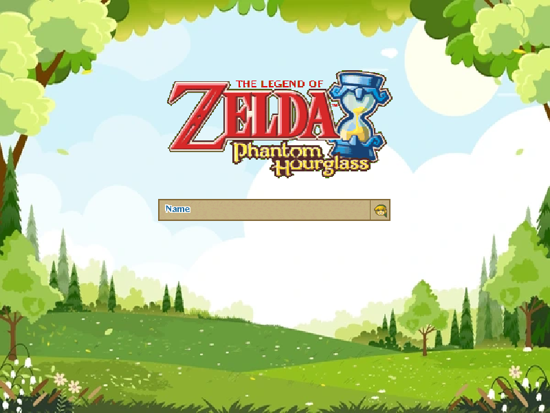
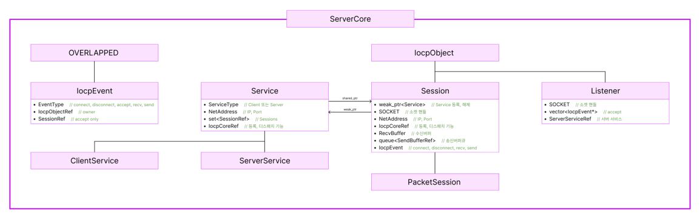
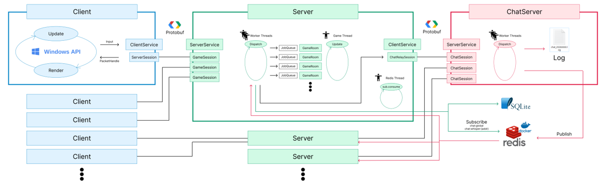
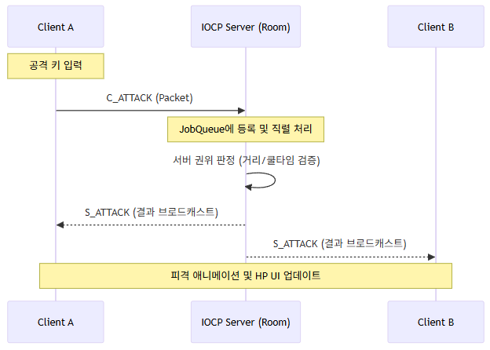
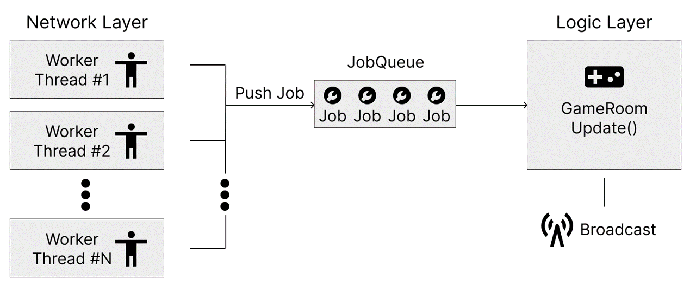
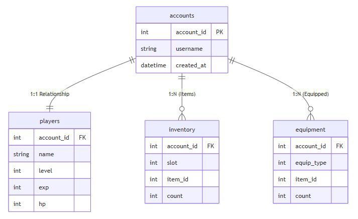

# 온라인 RPG 게임 (IOCP Server & WinAPI Client)

**WinAPI 클라이언트**와 **IOCP 기반 C++ 서버**를 직접 구현하여 구축한 서버 권위(Server-Authoritative) 구조의 RPG입니다.

<!-- 타이틀/플레이 이미지 -->

## 

## 📺 프로젝트 시연 영상

[](https://youtu.be/wyDDfSWafTo)

###### _위 이미지를 클릭하면 유튜브 시연 영상으로 이동합니다._

---

## 1. 프로젝트 개요

| 항목             | 내용                                                                                                              |
| ---------------- | ----------------------------------------------------------------------------------------------------------------- |
| **장르**         | 2D 타일맵 온라인 RPG                                                                                              |
| **개발 인원**    | 1인                                                                                                               |
| **기간**         | 2025.12.18 ~ 2026.04 (Phase 1: IOCP 게임 서버 · 클라이언트 — 8주 / Phase 2: Redis 채팅 · Logger · 리팩토링 — 2주) |
| **목적**         | IOCP 기반 게임 서버를 직접 구현하며 온라인 게임 서버 구조 학습                                                    |
| **언어**         | C++ (C++17)                                                                                                       |
| **네트워킹**     | Windows IOCP (비동기 I/O)                                                                                         |
| **렌더링**       | WinAPI GDI (더블 버퍼링)                                                                                          |
| **직렬화**       | Protocol Buffers (protobuf 21.12)                                                                                 |
| **데이터베이스** | SQLite (WAL 모드)                                                                                                 |
| **Redis**        | hiredis + redis-plus-plus (vcpkg), Docker 컨테이너                                                                |
| **빌드**         | Visual Studio Solution (.sln)                                                                                     |

### 핵심 게임플레이 루프

```
로그인 → 마을 접속 → 파티 결성 → 인스턴스 던전 입장 → 몬스터 사냥 및 레벨업 → 아이템 획득 및 장착
```

### 주요 기능

- 실시간 멀티플레이어 이동 / 전투 (검, 활, 마법봉)
- 인벤토리 / 장비 / 아이템 드롭 시스템
- 파티 시스템 (최대 4인, 초대/수락/탈퇴)
- 몬스터 AI (A\* 경로탐색, 어그로/리시 메커닉)
- 동적 던전 인스턴스 생성 / 인원 0명 시 자동 해제
- 독립 채팅 서버 (ChatServer) — IOCP 기반 별도 프로세스
- Redis Pub/Sub 기반 다중 GameServer 전체 채팅
- Redis String 기반 귓속말 크로스서버 라우팅
- Redis Sorted Set 기반 레벨 랭킹 시스템
- ChatServer ↔ GameServer 자동 재연결 로직
- CSV / JSON 기반 데이터 주도(Data-Driven) 설계
- 더미 클라이언트를 이용한 멀티스레드 부하 테스트

---

## 2. 아키텍처 다이어그램






---

## 3. 핵심 설계 패턴

#### ① 서버 권위적 검증 (Server-Authoritative Validation)

클라이언트의 입력은 단순 제안으로 취급하며, 서버가 이동, 공격 등 결과를 최종 결정한 후 브로드캐스트합니다.



#### ② JobQueue 기반 동시성

IOCP Worker Thread가 패킷 수신 후 룸의 `JobQueue`에 작업을 추가하고, 별도 Game Logic Thread가 순차 처리합니다.

- **IOCP Worker Threads**: `GQCS`로 패킷 수신 완료 감지 → `ServerPacketHandler`가 패킷 종류 판별 → 플레이어가 속한 `GameRoom`을 확인하고 해당 `JobQueue`에 작업 람다 투입
- **Game Logic Thread**: 각 룸의 JobQueue를 단일 스레드로 소진 — 룸 내부 상태에 뮤텍스 불필요



#### ③ 데이터 주도 설계 (Data-Driven Design)

게임 밸런스 수치는 코드 수정 없이 CSV/JSON 파일만 변경하면 됩니다.

| 파일                  | 내용                                    |
| --------------------- | --------------------------------------- |
| `RoomConfig.csv`      | 룸 정의 (스킬/스폰 활성화, 타일맵 경로) |
| `MonsterSpawn.json`   | 룸별 몬스터 스폰 그룹·위치              |
| `MonsterTemplate.csv` | 몬스터 스탯, 경험치, 드롭               |
| `MonsterDrop.csv`     | 아이템 드롭 확률 테이블                 |
| `ItemTemplate.csv`    | 아이템 타입, 수치, 최대 스택            |
| `LevelData.csv`       | 레벨업 필요 경험치, 스탯 증가량         |

#### ④ 고정 틱(50ms)과 이벤트 기반 처리 분리

`GameRoom::Update()`는 매 호출마다 두 단계로 진행합니다.

- **JobQueue 소진 (이벤트 기반)**: 이동 검증·공격 처리·로그인·로그아웃 등 패킷에서 유발된 작업을 즉시 처리
- **Step() — 50ms 고정 틱 (20Hz)**: Player 이동 보간, Monster AI (A\* 경로탐색·어그로·리시), Projectile 충돌·수명, SpawnSystem 리스폰 타이머

응답성이 중요한 로직은 이벤트 즉시 처리하고, 연속 시뮬레이션이 필요한 AI·보간만 고정 주기로 실행합니다.

```cpp
// GameRoom::Update() — Game Logic Thread에서 호출
void GameRoom::Update(uint64 now)
{
    // ① 이벤트 기반: 패킷 핸들러가 투입한 작업을 즉시 소진
    { LockGuard guard(_jobLock); std::swap(jobs, _jobs); }
    while (!jobs.empty()) { jobs.front()(); jobs.pop(); }

    // ② 고정 틱(50ms): 시뮬레이션 스텝 실행 (catch-up 방지용 상한 포함)
    while (now >= _nextTick && steps < kMaxCatchUp)
    {
        Step(_nextTick);    // Player 이동 보간 · Monster AI(A*) · Projectile · SpawnSystem
        _nextTick += kTickMs;
    }
}
```

#### ⑤ 동적 던전 인스턴스

파티장이 던전 입장 시 `CreateDungeonInstance()`로 룸을 동적 생성하고 고유 `instanceId`를 발급합니다. 파티원 전원 퇴장으로 인원이 0명이 되면 즉시 삭제하지 않고 `_pendingRemoveDungeon`에 등록한 뒤, `GameRoomManager::Update()` 말미에 일괄 `erase`합니다. `Update()` 중 `_dungeonInstances`를 순회하는 도중 직접 삭제하면 반복자가 무효화되기 때문입니다.

#### ⑥ Redis 활용 — 채팅 & 랭킹

| 자료구조   | 키                                   | 용도                                                                          |
| ---------- | ------------------------------------ | ----------------------------------------------------------------------------- |
| String     | `player:loc:{name}`                  | 플레이어가 접속 중인 GameServer 주소 (로그인 SET / 로그아웃 DEL)              |
| Sorted Set | `rank:level`                         | 레벨 랭킹 — 로그인·레벨업 시 `ZADD`, R키 요청 시 `ZREVRANGE`로 상위 10명 조회 |
| Pub/Sub    | `chat:global`, `chat:whisper:{addr}` | 전체 채팅 브로드캐스트 / 귓속말 크로스서버 라우팅                             |

**랭킹 구조:** 로그인·레벨업 시 `ZADD rank:level`로 점수를 갱신하고, 클라이언트가 R키를 누르면 IOCP 워커 스레드가 `ZREVRANGE rank:level 0 9`로 상위 10명을 조회해 `S_Ranking` 패킷으로 응답합니다.

**채팅 구조:** 각 GameServer는 시작 시 `RedisSubscriber::Start()`로 별도 스레드를 띄워 `chat:global`과 `chat:whisper:{자신의 주소}` 채널을 구독합니다.
ChatServer는 GameServer 목록을 전혀 알 필요 없이 Redis에 `PUBLISH`만 하면 되고, 구독 스레드의 `while(true) { sub.consume(); }` 루프가 메시지를 수신해 클라이언트에게 브로드캐스트합니다.

**귓속말 라우팅:** ChatServer가 `player:loc:{name}` 을 GET해 대상 플레이어의 서버 주소를 확인한 뒤 해당 서버의 `chat:whisper:{addr}` 채널에 PUBLISH합니다.
Redis 연결이 없으면 TCP `BroadcastAll`로 폴백합니다.

#### ⑦ 데이터베이스 설계 (SQLite)



- 로그인: `C_Login` → `DBManager::FindOrCreateAccount()` → 플레이어 데이터 로드 → `Player::ApplyFromSaveData()`
- 로그아웃: `OnDisconnected()` → 스탯·인벤토리 저장 → SQLite WAL 커밋

---

## 4. 솔루션 구성

### 4-1. ServerCore — IOCP 네트워크 인프라

재사용 가능한 저수준 네트워킹 라이브러리로 `ServerCore.lib`으로 빌드됩니다. 게임 서버·채팅 서버 모두 이 위에서 동작합니다.

| 클래스                      | 역할                                                                      |
| --------------------------- | ------------------------------------------------------------------------- |
| `IocpCore`                  | IOCP 핸들 관리, `GetQueuedCompletionStatus` Dispatch 루프                 |
| `IocpObject`                | IOCP 등록 가능한 객체의 기반 인터페이스                                   |
| `Session`                   | 비동기 TCP 세션 (Connect / Disconnect / Recv / Send 이벤트)               |
| `PacketSession`             | `Session` 확장 — `PacketHeader { uint16 size; uint16 id; }` 프레이밍 처리 |
| `Service`                   | ServerService(Accept) / ClientService(Connect) 진입점; 세션 생성          |
| `Listener`                  | `AcceptEx` 기반 비동기 연결 수락                                          |
| `SendBuffer` / `RecvBuffer` | 비동기 I/O용 버퍼 래퍼                                                    |
| `ThreadManager`             | IOCP 워커 스레드 풀 생성·관리                                             |
| `BufferReader`              | Protobuf 역직렬화 헬퍼                                                    |

---

### 4-2. Server — 게임 로직 레이어

#### 게임 오브젝트 상속 계층

```
GameObject          ← 모든 네트워크 엔티티 기반 (위치·상태·방향·ObjectInfo)
  └─ Creature       ← 생명체 공통 (HP·방어력, OnDamaged)
       ├─ Player    ← 인벤토리, 레벨업, 장비 시스템
       └─ Monster   ← AI (홈 위치, 어그로/리시 범위, A* 경로탐색)
  └─ Projectile     ← 발사체 기반 (소유자 추적, 수명 관리)
       └─ Arrow     ← 화살 발사체 (충돌 판정)
```

#### 룸 관리

| 클래스            | 역할                                                                     |
| ----------------- | ------------------------------------------------------------------------ |
| `GameRoom`        | 오브젝트 관리, A\* 경로탐색, JobQueue, 50ms 틱(20Hz)                     |
| `CombatSystem`    | 전투(검/활/스태프) 처리, 데미지 계산, 경험치 분배, 아이템 드롭           |
| `SpawnSystem`     | 초기 스폰, 몬스터 리스폰 큐 관리                                         |
| `GameRoomManager` | 정적 룸(마을/채널)과 동적 룸(던전/인스턴스) 관리; 인스턴스 생명주기 제어 |
| `Tilemap`         | 타일 기반 충돌 맵 (통행 가능 여부 조회)                                  |

**서버 틱 처리 순서 (50ms마다):**

```
1. JobQueue 소진   — IOCP 스레드가 추가한 작업 순차 처리
2. Player::Update()     — 이동 보간
3. Monster::Update()    — AI 경로탐색·어그로 판정
4. Projectile::Update() — 수명 감소·충돌 판정
5. SpawnSystem::Tick()  — 몬스터 리스폰 타이머
6. Broadcast()          — 변경 사항 전체 플레이어 배포
```

#### 주요 게임 시스템

| 클래스            | 역할                                                                                                     |
| ----------------- | -------------------------------------------------------------------------------------------------------- |
| `PartyManager`    | 파티 생성·해산·초대·탈퇴 (최대 4인); 던전 입장 조율; USE_LOCK/WRITE_LOCK 스레드 안전, 재진입 데드락 방지 |
| `DBManager`       | SQLite 인터페이스; 로그인/로그아웃 시 플레이어 데이터 로드·저장                                          |
| `RoomDataManager` | CSV/JSON 설정 파일 로드; 몬스터·아이템·레벨·룸 정의 템플릿 관리                                          |

#### 네트워크 / 세션

| 클래스                               | 역할                                                                                              |
| ------------------------------------ | ------------------------------------------------------------------------------------------------- |
| `GameSession`                        | 플레이어 연결 1개 표현; 패킷을 GameRoom JobQueue로 전달                                           |
| `GameSessionManager`                 | 활성 플레이어 연결 중앙 관리; 브로드캐스트 지원                                                   |
| `ServerPacketHandler`                | Protobuf 패킷 → 핸들러 함수 매핑 (수신 ~13종, 송신 ~17종)                                         |
| `ChatConnector` / `ChatRelaySession` | ChatServer와의 TCP 연결 관리; SS_BroadcastChat 수신 및 채팅 타입별 디스패치; 5초 간격 자동 재연결 |

---

### 4-3. ChatServer — 채팅 릴레이 서버

게임 서버와 독립적으로 동작하는 별도 실행 파일입니다.

| 클래스               | 역할                                                            |
| -------------------- | --------------------------------------------------------------- |
| `ChatSession`        | 개별 GameServer 연결 세션                                       |
| `ChatSessionManager` | 모든 활성 연결 관리; 전체 브로드캐스트                          |
| `ChatPacketHandler`  | SS_RelayChat 수신 → 채팅 타입별 Redis PUBLISH 또는 BroadcastAll |
| `RedisClient`        | Redis 연결 싱글톤; PUBLISH / GET 담당                           |

---

### 4-4. Client — 렌더링 및 게임 클라이언트

#### 엔진 코어

| 클래스            | 역할                                                        |
| ----------------- | ----------------------------------------------------------- |
| `Game`            | WinAPI 메인 루프; HDC 더블 버퍼링; Update / Render 디스패치 |
| `TimeManager`     | 델타 타임 계산                                              |
| `InputManager`    | Win32 가상 키 상태 추적 (Press / Down / Up)                 |
| `ResourceManager` | 텍스처·스프라이트·플립북·타일맵·사운드 싱글톤 캐시          |
| `SoundManager`    | Win32 `mciSendCommand` 래퍼                                 |

**클라이언트 프레임 처리 순서:**

```
1. TimeManager::Update()      — 델타 타임 갱신
2. InputManager::Update()     — 키보드/마우스 폴링
3. NetworkManager::Update()   — 수신 패킷 디스패치 (서버 보정 즉시 반영)
4. SceneManager::Update()     — 씬 내 모든 Actor::Tick()
5. SceneManager::Render()     — 버퍼 클리어 → 레이어별 Actor 렌더 → UI 렌더 → SwapBuffers
```

| 클래스         | 역할                                                 |
| -------------- | ---------------------------------------------------- |
| `Texture`      | GDI 비트맵 래퍼 (HBITMAP, HDC)                       |
| `Sprite`       | UV 사각형을 가진 2D 이미지; 텍스처 캐싱              |
| `Flipbook`     | 프레임 지속 시간을 가진 스프라이트 애니메이션 시퀀스 |
| `TilemapActor` | 타일맵 데이터를 이용한 타일 그리드 렌더링            |

#### UI 시스템

| 클래스             | 역할                                                                                                                                     |
| ------------------ | ---------------------------------------------------------------------------------------------------------------------------------------- |
| `UIManager`        | 패널 소유 및 생명주기 관리; HUD 렌더링(HP바·EXP바·무기 아이콘); UI 입력 처리(I/R/Enter/ESC 등); `IsInputConsumed()`로 DevScene 입력 차단 |
| `UI`               | 기본 위젯 (위치, 크기, 가시성, 활성 상태)                                                                                                |
| `Panel`            | 자식 UI 컨테이너, 로컬 오프셋 포지셔닝, 드래그 지원                                                                                      |
| `Button`           | 클릭 콜백을 가진 클릭 가능한 버튼                                                                                                        |
| `InventoryPanel`   | 27슬롯 인벤토리 그리드 + 장비 미리보기                                                                                                   |
| `PartyPanel`       | 파티원 HP 바 및 이름 표시                                                                                                                |
| `PartyInvitePanel` | 파티 초대 수락/거절 다이얼로그                                                                                                           |
| `ChatPanel`        | 스크롤 가능한 채팅 기록                                                                                                                  |
| `RankingPanel`     | 레벨 기준 상위 플레이어 리더보드                                                                                                         |

---

### 4-5. DummyClient — 봇 테스트 클라이언트

클라이언트를 여러 개 수동으로 띄우지 않고도 다중 접속 시나리오를 테스트하기 위해 만든 도구입니다. 타이머 기반으로 이동·공격을 자동 스케줄링하는 봇을 N개 실행합니다.
