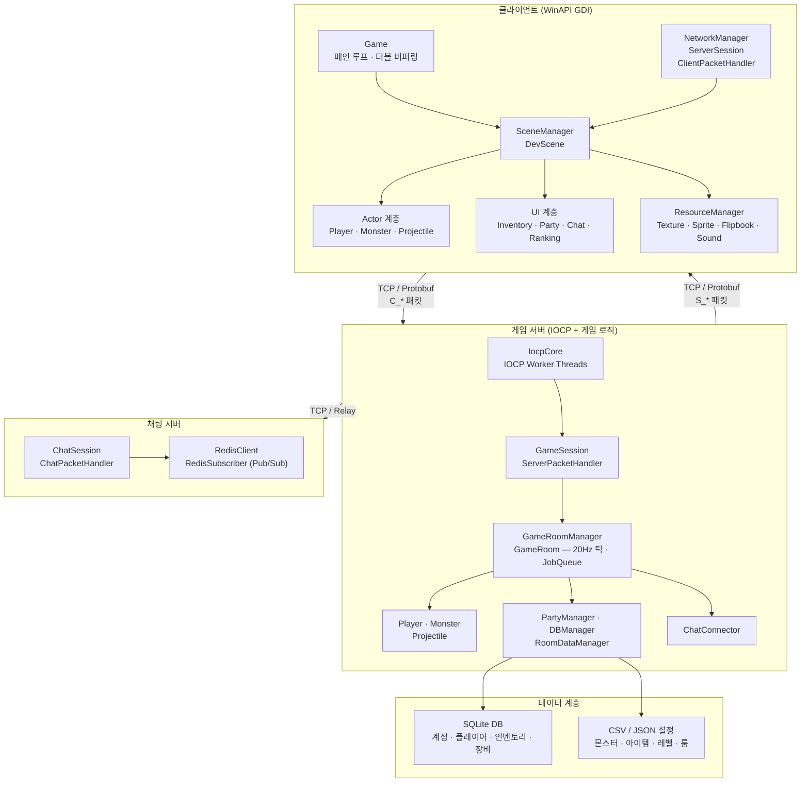
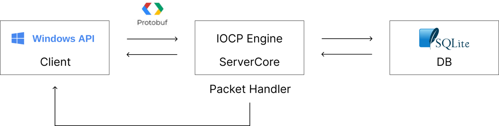

# 온라인 RPG 게임 (IOCP Server & WinAPI Client)

**WinAPI 클라이언트**와 **IOCP 기반 C++ 서버**를 직접 구현하여 구축한 서버 권위(Server-Authoritative) 구조의 RPG입니다.

<!-- 타이틀/플레이 이미지 -->


---

## 📺 프로젝트 시연 영상
[](https://youtu.be/wyDDfSWafTo)
###### *위 이미지를 클릭하면 유튜브 시연 영상으로 이동합니다.*

---

## 1. 프로젝트 개요

| 항목 | 내용 |
|------|------|
| **장르** | 2D 타일맵 온라인 RPG |
| **개발 인원** | 1인 |
| **기간** | 2025.12.18 ~ 2026.02.12 (8주) |
| **목적** | IOCP 기반 게임 서버를 직접 구현하며 온라인 게임 서버 구조 학습 |
| **언어** | C++ (C++17) |
| **네트워킹** | Windows IOCP (비동기 I/O) |
| **렌더링** | WinAPI GDI (더블 버퍼링) |
| **직렬화** | Protocol Buffers (protobuf 21.12) |
| **데이터베이스** | SQLite (WAL 모드) |
| **빌드** | Visual Studio Solution (.sln) |

### 핵심 게임플레이 루프

```
로그인 → 마을 접속 → 파티 결성 → 인스턴스 던전 입장 → 몬스터 사냥 및 레벨업 → 아이템 획득 및 장착
```

### 주요 기능

- 실시간 멀티플레이어 이동 / 전투 (검, 활, 마법봉)
- 인벤토리 / 장비 / 아이템 드롭 시스템
- 파티 시스템 (최대 4인, 초대/수락/탈퇴)
- 몬스터 AI (A* 경로탐색, 어그로/리시 메커닉)
- 동적 던전 인스턴스 생성 / 인원 0명 시 자동 해제
- 별도 채팅 서버 (Redis Pub/Sub 기반)
- CSV / JSON 기반 데이터 주도(Data-Driven) 설계
- 더미 클라이언트를 이용한 멀티스레드 부하 테스트

---

## 2. 아키텍처 레이어 다이어그램

### 전체 시스템 구성

```
┌─────────────────────────────────────────────────────────────────┐
│                        Client (Win32 GDI)                       │
│  InputManager  ──►  Game Loop  ──►  SceneManager  ──►  Render  │
│                          │                                       │
│                    NetworkManager                                │
└──────────────────────────┼──────────────────────────────────────┘
                           │ TCP (Protobuf Packet)
┌──────────────────────────▼──────────────────────────────────────┐
│                      Game Server (IOCP)                         │
│  IOCP Worker Threads  ──►  GameSession  ──►  GameRoom.JobQueue  │
│                                │                                 │
│                          GameRoomManager                         │
│                     (Static Rooms + Dungeon Instances)          │
│                                │                                 │
│               SQLite (DBManager) / Redis (RedisClient)          │
└───────────────────────┬─────────────────────────────────────────┘
                        │ TCP (Relay Packet)
┌───────────────────────▼─────────────────────────────────────────┐
│                     Chat Server (IOCP)                          │
│  ChatSession  ──►  ChatSessionManager  ──►  Redis Pub/Sub       │
└─────────────────────────────────────────────────────────────────┘
```

### Mermaid 아키텍처 다이어그램


```mermaid
graph TB
    subgraph CLIENT["클라이언트 (WinAPI GDI)"]
        direction TB
        CGame["Game\n메인 루프 · 더블 버퍼링"]
        CScene["SceneManager\nDevScene"]
        CActor["Actor 계층\nPlayer · Monster · Projectile"]
        CUI["UI 계층\nInventory · Party · Chat · Ranking"]
        CResource["ResourceManager\nTexture · Sprite · Flipbook · Sound"]
        CNet["NetworkManager\nServerSession\nClientPacketHandler"]

        CGame --> CScene
        CScene --> CActor & CUI
        CScene --> CResource
        CNet --> CScene
    end

    subgraph SERVER["게임 서버 (IOCP + 게임 로직)"]
        direction TB
        SIOCP["IocpCore\nIOCP Worker Threads"]
        SSession["GameSession\nServerPacketHandler"]
        SRoom["GameRoomManager\nGameRoom — 20Hz 틱 · JobQueue"]
        SObjects["Player · Monster\nProjectile"]
        SSystems["PartyManager · DBManager\nRoomDataManager"]
        SChatConn["ChatConnector"]

        SIOCP --> SSession --> SRoom --> SObjects
        SRoom --> SSystems & SChatConn
    end

    subgraph CHAT["채팅 서버"]
        ChatSession["ChatSession\nChatPacketHandler"]
        Redis["RedisClient\nRedisSubscriber (Pub/Sub)"]
        ChatSession --> Redis
    end

    subgraph DATA["데이터 계층"]
        SQLite["SQLite DB\n계정 · 플레이어 · 인벤토리 · 장비"]
        CSV["CSV / JSON 설정\n몬스터 · 아이템 · 레벨 · 룸"]
    end

    CLIENT -- "TCP / Protobuf\nC_* 패킷" --> SERVER
    SERVER -- "TCP / Protobuf\nS_* 패킷" --> CLIENT
    SERVER -- "TCP / Relay" --> CHAT
    SSystems --> SQLite & CSV
```

---

## 3. 주요 컴포넌트 설명

### 3-1. ServerCore — IOCP 네트워크 인프라

재사용 가능한 저수준 네트워킹 라이브러리로 `ServerCore.lib`으로 빌드됩니다. 게임 서버·채팅 서버 모두 이 위에서 동작합니다.

| 클래스 | 역할 |
|--------|------|
| `IocpCore` | IOCP 핸들 관리, `GetQueuedCompletionStatus` Dispatch 루프 |
| `IocpObject` | IOCP 등록 가능한 객체의 기반 인터페이스 |
| `Session` | 비동기 TCP 세션 (Connect / Disconnect / Recv / Send 이벤트) |
| `PacketSession` | `Session` 확장 — `PacketHeader { uint16 size; uint16 id; }` 프레이밍 처리 |
| `Service` | ServerService(Accept) / ClientService(Connect) 진입점; 세션 생성 |
| `Listener` | `AcceptEx` 기반 비동기 연결 수락 |
| `SendBuffer` / `RecvBuffer` | 비동기 I/O용 버퍼 래퍼 |
| `ThreadManager` | IOCP 워커 스레드 풀 생성·관리 |
| `BufferReader` / `BufferWriter` | Protobuf 직렬화·역직렬화 헬퍼 |

#### 스레딩 모델

```
IOCP Worker Threads (여러 개, 병렬)
  └─ GQCS 이벤트 → 수신 패킷 → 룸의 JobQueue에 작업(함수 객체) 추가

Game Logic Thread (룸당 단일)
  └─ JobQueue 순차 처리 → 뮤텍스 없이 레이스 컨디션 제거
  └─ 50ms 틱 (20Hz) 주기로 Update() 실행
```

---

### 3-2. Server — 게임 로직 레이어

#### 게임 오브젝트 상속 계층

```
GameObject          ← 모든 네트워크 엔티티 기반 (위치·상태·방향·ObjectInfo)
  └─ Creature       ← 생명체 공통 (HP·방어력, OnDamaged)
       ├─ Player    ← 인벤토리, 레벨업, 장비 시스템
       └─ Monster   ← AI (홈 위치, 어그로/리시 범위, A* 경로탐색)
  └─ Projectile     ← 발사체 기반 (소유자 추적, 수명 관리)
       └─ Arrow     ← 화살 발사체 (충돌 판정)
```

#### 룸 관리

| 클래스 | 역할 |
|--------|------|
| `GameRoom` | 핵심 게임 상태 컨테이너. 플레이어·몬스터·JobQueue·A* 경로탐색·전투 검증 관리. 50ms 틱(20Hz) |
| `GameRoomManager` | 정적 룸(마을/채널)과 동적 던전 인스턴스 관리; 인스턴스 생명주기 제어 |
| `Tilemap` | 타일 기반 충돌 맵 (통행 가능 여부 조회) |

**서버 틱 처리 순서 (50ms마다):**
```
1. JobQueue 소진   — IOCP 스레드가 추가한 작업 순차 처리
2. Player::Update()     — 이동 보간
3. Monster::Update()    — AI 경로탐색·어그로 판정
4. Projectile::Update() — 수명 감소·충돌 판정
5. ProcessRespawn()     — 몬스터 리스폰 타이머
6. Broadcast()          — 변경 사항 전체 플레이어 배포
```

#### 주요 게임 시스템

| 클래스 | 역할 |
|--------|------|
| `PartyManager` | 파티 생성·해산·초대·탈퇴 (최대 4인); 던전 입장 조율 |
| `DBManager` | SQLite 인터페이스; 로그인/로그아웃 시 플레이어 데이터 로드·저장 |
| `RoomDataManager` | CSV/JSON 설정 파일 로드; 몬스터·아이템·레벨·룸 정의 템플릿 관리 |
| `ChatConnector` | 게임 서버 ↔ 채팅 서버 TCP 릴레이 연결 |

#### 네트워크 / 세션

| 클래스 | 역할 |
|--------|------|
| `GameSession` | 플레이어 연결 1개 표현; 패킷을 GameRoom JobQueue로 전달 |
| `GameSessionManager` | 활성 플레이어 연결 중앙 관리; 브로드캐스트 지원 |
| `ServerPacketHandler` | Protobuf 패킷 → 핸들러 함수 매핑 (수신 ~13종, 송신 ~17종) |

---

### 3-3. Client — 렌더링 및 게임 클라이언트

#### 엔진 코어

| 클래스 | 역할 |
|--------|------|
| `Game` | WinAPI 메인 루프; HDC 더블 버퍼링; Update / Render 디스패치 |
| `TimeManager` | 델타 타임 계산 |
| `InputManager` | Win32 가상 키 상태 추적 (Press / Down / Up) |
| `ResourceManager` | 텍스처·스프라이트·플립북·타일맵·사운드 싱글톤 캐시 |
| `SoundManager` | Win32 `mciSendCommand` 래퍼 |

**클라이언트 프레임 처리 순서:**
```
1. InputManager::Update()     — 키보드/마우스 폴링
2. NetworkManager::Update()   — 수신 패킷 디스패치
3. SceneManager::Update()     — 씬 내 모든 Actor::Tick()
4. SceneManager::Render()     — 버퍼 클리어 → 레이어별 Actor 렌더 → UI 렌더 → SwapBuffers
```

#### 씬 관리

```
SceneManager
  └── Scene (현재 활성 씬 — DevScene)
        ├── _actors[LAYER_*]   (월드 오브젝트, 레이어별 렌더링 순서)
        └── _uis               (UI 오브젝트 목록)
```

#### 게임 오브젝트 상속 계층

```
Actor                     (위치, 레이어, 컴포넌트, BeginPlay/Tick/Render 생명주기)
  └─ FlipbookActor        (프레임 시퀀스 시간 기반 재생)
       └─ GameObject      (서버 동기화 상태머신 IDLE/MOVE/SKILL, ObjectInfo)
            └─ Creature   (HP·스탯 Status 구조체, OnDamaged)
                 ├─ Player     (무기별 플립북 세트 — 검/활/스태프)
                 │    └─ MyPlayer  (로컬 입력, 예측 이동, 인벤토리/파티 UI 연동)
                 └─ Monster    (서버 수신 위치로 보간 이동)
```

| 클래스 | 역할 |
|--------|------|
| `Texture` | GDI 비트맵 래퍼 (HBITMAP, HDC) |
| `Sprite` | UV 사각형을 가진 2D 이미지; 텍스처 캐싱 |
| `Flipbook` | 프레임 지속 시간을 가진 스프라이트 애니메이션 시퀀스 |
| `TilemapActor` | 타일맵 데이터를 이용한 타일 그리드 렌더링 |

#### UI 시스템

| 클래스 | 역할 |
|--------|------|
| `UI` | 기본 위젯 (위치, 크기, 가시성, 활성 상태) |
| `Panel` | 자식 UI 컨테이너, 로컬 오프셋 포지셔닝, 드래그 지원 |
| `Button` | 클릭 콜백을 가진 클릭 가능한 버튼 |
| `InventoryPanel` | 27슬롯 인벤토리 그리드 + 장비 미리보기 |
| `PartyPanel` | 파티원 HP 바 및 이름 표시 |
| `PartyInvitePanel` | 파티 초대 수락/거절 다이얼로그 |
| `ChatPanel` | 스크롤 가능한 채팅 기록 |
| `RankingPanel` | 레벨 기준 상위 플레이어 리더보드 |

#### 네트워크

```
NetworkManager  ──►  ServerSession (PacketSession)
                           │
                    ClientPacketHandler  ──►  DevScene / MyPlayer 갱신
```

---

### 3-4. ChatServer — 채팅 릴레이 서버

게임 서버와 독립적으로 동작하는 별도 실행 파일입니다.

| 클래스 | 역할 |
|--------|------|
| `ChatSession` | 개별 채팅 클라이언트 연결 |
| `ChatSessionManager` | 모든 활성 채팅 연결 관리 |
| `ChatPacketHandler` | 채팅 프로토콜 메시지 처리 |
| `RedisClient` | 오프라인 배달을 위한 메시지 영속 저장 |
| `RedisSubscriber` | 서버 간 채팅 릴레이를 위한 Redis Pub/Sub |

---

### 3-5. DummyClient — 부하 테스트 도구

타이머 기반으로 이동·공격을 스케줄링하는 봇 클라이언트입니다. IOCP 멀티스레딩 성능 측정에 사용되었습니다.

---

### 3-6. 핵심 설계 패턴

#### ① 서버 권위적 검증 (Server-Authoritative Validation)

클라이언트의 입력은 단순 제안으로 취급합니다. 서버가 무기 사거리·충돌·데미지를 최종 결정한 후 브로드캐스트합니다.

```
클라이언트: C_Attack (위치, 방향, 무기 타입) ──►
서버: 사거리 검증 → 충돌 판정 → 방어력 적용 → S_Damaged 브로드캐스트
```

#### ② JobQueue 기반 동시성

IOCP 네트워크 스레드가 룸의 `JobQueue`에 작업을 추가하고, 단일 게임 로직 스레드가 순차 처리합니다. 뮤텍스 없이 룸 단위 레이스 컨디션을 제거합니다.

#### ③ 컴포넌트 기반 액터 시스템

`Actor = 위치 + 레이어 + 컴포넌트`로 구성되어 행동을 자유롭게 조합할 수 있습니다 (CameraComponent, AnimationComponent 등).

#### ④ 데이터 주도 설계 (Data-Driven Design)

게임 밸런스 수치는 코드 수정 없이 CSV/JSON 파일만 변경하면 됩니다.

| 파일 | 내용 |
|------|------|
| `RoomConfig.csv` | 룸 정의 (스킬/스폰 활성화, 타일맵 경로) |
| `MonsterSpawn.json` | 룸별 몬스터 스폰 그룹·위치 |
| `MonsterTemplate.csv` | 몬스터 스탯, 경험치, 드롭 |
| `MonsterDrop.csv` | 아이템 드롭 확률 테이블 |
| `ItemTemplate.csv` | 아이템 타입, 수치, 최대 스택 |
| `LevelData.csv` | 레벨업 필요 경험치, 스탯 증가량 |

#### ⑤ A* 경로탐색 기반 몬스터 AI

`priority_queue<PQNode>`를 이용한 A* 알고리즘으로 50ms마다 경로를 갱신합니다. 리시 범위를 벗어나면 홈 위치로 귀환합니다.

#### ⑥ 동적 던전 인스턴스

`GameRoomManager::CreateDungeonInstance()`로 룸을 동적 생성하고, 인원이 0명이 되면 `RequestRemoveDungeonInstance()`로 안전하게 해제합니다.

#### ⑦ 싱글톤 패턴 (`DECLARE_SINGLE` 매크로)

`RoomDataManager`, `DBManager`, `ResourceManager`, `NetworkManager`, `SoundManager` 등 주요 매니저를 싱글톤으로 관리합니다.

#### ⑧ SRP 기반 리팩토링 — OnDamaged 분리

```cpp
// Before: 공격자 정보와 방어력을 OnDamaged가 직접 참조 (높은 결합도)
bool Creature::OnDamaged(CreatureRef attacker, int32& outDamage, float multiplier) {
    int32 baseDamage = attacker->info.attack() - info.defence();
    int32 damage = max(1, (int32)(baseDamage * multiplier));
    info.set_hp(max(0, info.hp() - damage));
    return true;
}

// After: 데미지 계산은 상위(GameRoom)에서, OnDamaged는 HP 차감만 담당
bool Creature::OnDamaged(int32 damage) {
    if (damage <= 0) return false;
    info.set_hp(max(0, info.hp() - damage));
    return true;
}
```

---

## 4. 시스템 아키텍처 세부 사항

### 스레드 모델 및 동기화

동시 접속 환경에서 **IOCP 모델**을 채택하여 비동기 I/O를 처리하고, **JobQueue 기반 직렬 처리**로 로직 안정성을 확보했습니다.

- **IOCP Worker Threads**: `AcceptEx`와 `GQCS`를 통해 여러 연결을 비동기로 처리하며 패킷을 수신합니다.
- **Game Logic Thread**: 네트워크 스레드와 게임 로직을 분리하여, 각 룸의 `JobQueue`에 쌓인 작업을 단일 스레드에서 순차 처리합니다.
- **실행 모드 분리**: `Server.exe`(single) / `Server.exe multi [workerCount]`(multi) 모드를 지원하여 동일 시나리오 성능 비교가 가능합니다.




### 네트워크 프로토콜 (Protobuf)

**패킷 헤더:** `struct PacketHeader { uint16 size; uint16 id; }` + Protobuf 페이로드

| 방향 | 주요 패킷 |
|------|-----------|
| **Client → Server** | C_Login, C_Move, C_Attack, C_Turn, C_EquipItem, C_UnequipItem, C_UseItem, C_PartyInvite, C_PartyAnswer, C_PartyLeave, C_Chat, C_GetRanking |
| **Server → Client** | S_EnterGame, S_MyPlayer, S_AddObject, S_RemoveObject, S_Move, S_Attack, S_Damaged, S_GainExp, S_LevelUp, S_InventoryData, S_AddItem, S_EquipItem, S_PartyUpdate, S_Chat, S_Ranking |

---

### 데이터베이스 설계 (SQLite)

별도 DB 서버 없이 실행 가능한 **SQLite**를 사용합니다. WAL 모드로 읽기·쓰기 경합을 완화했습니다.

#### ERD


```
Accounts    (account_id PK, username)
  └─ Players    (account_id FK, name, level, exp, hp)
  └─ Inventory  (account_id FK, slot_id, itemId, count)
  └─ Equipment  (account_id FK, equipType, itemId)
```

**데이터 흐름:**
- 로그인: `C_Login` → `DBManager::FindOrCreateAccount()` → 플레이어 데이터 로드 → `Player::ApplyFromSaveData()`
- 로그아웃: `OnDisconnected()` → 스탯·인벤토리 저장 → SQLite WAL 커밋

---

### 서버 권위 판정 시퀀스


---

## 5. 멀티스레드 성능 측정

DummyClient 100개를 동원하여 단일 스레드 대비 멀티스레드 서버의 처리량(Throughput)을 실측했습니다.
###### `docs/benchmarks/` 참고

### 실험 조건

- **Single**: `Server.exe` / **Multi**: `Server.exe multi 8`
- DummyClient: 100 bots, 이동 120ms 간격, 공격 700ms 간격
- 측정 시간: 180초 / 반복: Single 3회, Multi 3회 평균

| 지표 (Packet/sec) | Single Thread | Multi Thread | 개선율 |
|-------------------|---------------|--------------|--------|
| **S_Move (이동)** | 112.37 | **388.98** | **+246.1%** |
| **S_Attack (공격)** | 110.69 | **260.42** | **+135.2%** |
| **S_Damaged (피격)** | 14.34 | **179.01** | **+1148.2%** |

멀티스레드 전환 후 **피격(Damaged) 지표가 약 11배** 향상되었습니다.

---

## 6. 디렉토리 구조

```
zelda-clone-cpp/
├── Zelda-Winapi/
│   │
│   ├── ServerCore/              # IOCP 네트워크 저수준 라이브러리 (ServerCore.lib)
│   │   ├── IocpCore.*           # IOCP 핸들 및 Dispatch 루프
│   │   ├── Session.*            # 비동기 TCP 세션 기반 클래스
│   │   ├── PacketSession.*      # 패킷 헤더 프레이밍
│   │   ├── Service.*            # Listener(Accept) / Connector(Connect)
│   │   ├── Listener.*           # AcceptEx 기반 비동기 연결 수락
│   │   ├── ThreadManager.*      # IOCP 워커 스레드 풀
│   │   ├── SendBuffer.*         # 송신 버퍼
│   │   ├── RecvBuffer.*         # 수신 버퍼
│   │   ├── BufferReader.*       # Protobuf 역직렬화
│   │   └── BufferWriter.*       # Protobuf 직렬화
│   │
│   ├── Server/                  # 게임 서버 — 로직 및 서버 사이드 시뮬레이션
│   │   ├── GameRoom.*           # 룸 단위 게임 로직 (20Hz 틱, 전투, AI, JobQueue)
│   │   ├── GameRoomManager.*    # Static/Instance 룸 수명 관리
│   │   ├── GameSession.*        # 세션 ↔ Player 바인딩, 패킷 디스패치
│   │   ├── GameSessionManager.* # 전체 세션 목록 관리
│   │   ├── ServerPacketHandler.*# Protobuf 패킷 → 핸들러 매핑
│   │   ├── GameObject.*         # 네트워크 엔티티 기반 클래스
│   │   ├── Creature.*           # 생명체 공통 (HP, OnDamaged)
│   │   ├── Player.*             # 인벤토리, 레벨업, 장비
│   │   ├── Monster.*            # A* AI, 어그로/리시
│   │   ├── Projectile.*         # 발사체 기반 (수명, 소유자 추적)
│   │   ├── Arrow.*              # 화살 발사체
│   │   ├── Tilemap.*            # 타일 기반 충돌 맵
│   │   ├── PartyManager.*       # 파티 시스템 (최대 4인)
│   │   ├── DBManager.*          # SQLite 인터페이스 (영속화)
│   │   ├── RoomDataManager.*    # CSV/JSON 설정 파일 로더
│   │   └── ChatConnector.*      # 채팅 서버 TCP 릴레이 브리지
│   │
│   ├── Client/                  # 게임 클라이언트 — WinAPI GDI 렌더링 + UI
│   │   ├── Game.*               # 엔진 진입점, 더블 버퍼링
│   │   ├── SceneManager.*       # 씬 전환, 카메라 위치
│   │   ├── Scene.*              # 액터 컨테이너, 레이어별 렌더링
│   │   ├── Actor.*              # 기반 엔티티 (Tick/Render 생명주기)
│   │   ├── Component.*          # 행동 컴포넌트 시스템
│   │   ├── DevScene.*           # 주 게임 씬
│   │   ├── GameObject.*         # 클라이언트 네트워크 엔티티
│   │   ├── Creature.*           # 체력·스탯 시각화
│   │   ├── Player.*             # 무기별 애니메이션 세트
│   │   ├── MyPlayer.*           # 로컬 입력, 예측 이동
│   │   ├── Monster.*            # 몬스터 보간 이동·렌더링
│   │   ├── Arrow.*              # 화살 애니메이션
│   │   ├── Texture.*            # GDI 비트맵 래퍼
│   │   ├── Sprite.*             # 2D 이미지 (UV 사각형)
│   │   ├── Flipbook.*           # 스프라이트 애니메이션 시퀀스
│   │   ├── TilemapActor.*       # 타일 그리드 렌더링
│   │   ├── ResourceManager.*    # 리소스 싱글톤 캐시
│   │   ├── TimeManager.*        # 델타 타임 계산
│   │   ├── InputManager.*       # 키보드/마우스 입력 폴링
│   │   ├── NetworkManager.*     # 게임 서버 연결 싱글톤
│   │   ├── ServerSession.*      # 서버 연결 세션
│   │   ├── ClientPacketHandler.*# S_* 패킷 라우터
│   │   ├── SoundManager.*       # mciSendCommand 래퍼
│   │   ├── UI.*                 # 기본 위젯
│   │   ├── Panel.*              # UI 컨테이너 (드래그 지원)
│   │   ├── Button.*             # 클릭 가능한 버튼
│   │   ├── InventoryPanel.*     # 인벤토리 그리드 + 장비 미리보기
│   │   ├── PartyPanel.*         # 파티원 HP 바
│   │   ├── PartyInvitePanel.*   # 파티 초대 다이얼로그
│   │   ├── ChatPanel.*          # 스크롤 채팅 기록
│   │   └── RankingPanel.*       # 레벨 기준 리더보드
│   │
│   ├── ChatServer/              # 채팅 전용 서버 (별도 실행 파일)
│   │   ├── ChatSession.*
│   │   ├── ChatSessionManager.*
│   │   ├── ChatPacketHandler.*
│   │   ├── RedisClient.*        # Redis 영속 저장
│   │   └── RedisSubscriber.*    # Redis Pub/Sub
│   │
│   ├── DummyClient/             # 부하 테스트 봇 클라이언트
│   │   └── ServerSession.*      # 타이머 기반 봇 AI (이동/공격)
│   │
│   ├── Common/                  # 공유 Protobuf 스키마 (.proto)
│   │
│   ├── Datasheets/              # 서버용 데이터 주도 설정 파일
│   │   ├── RoomConfig.csv       # 룸 정의 (스킬/스폰 활성화, 타일맵 경로)
│   │   ├── MonsterSpawn.json    # 룸별 몬스터 스폰 그룹·위치
│   │   ├── MonsterTemplate.csv  # 몬스터 스탯, 경험치, 드롭
│   │   ├── MonsterDrop.csv      # 아이템 드롭 확률 테이블
│   │   ├── ItemTemplate.csv     # 아이템 타입, 수치, 최대 스택
│   │   └── LevelData.csv        # 레벨업 필요 경험치, 스탯 증가량
│   │
│   ├── DatasheetsClient/        # 클라이언트용 게임 데이터
│   │
│   ├── Libraries/               # 외부 라이브러리 (Protobuf 21.12 헤더·라이브러리)
│   │
│   ├── Resources/               # 게임 에셋
│   │   ├── Sprite/              # Player, Monster, Effect, Item, Map, UI 스프라이트
│   │   ├── Tilemap/             # 타일맵 이미지
│   │   └── Sound/               # BGM, SFX
│   │
│   └── Zelda-Winapi.sln         # Visual Studio 솔루션 (5개 프로젝트)
│
├── docs/                        # 문서 및 벤치마크 결과
│   └── benchmarks/
├── media/                       # README용 이미지 (스크린샷, 다이어그램)
├── docker-compose.yml           # Redis 컨테이너 설정
├── redis-start.bat              # Redis 시작 스크립트
└── redis-stop.bat               # Redis 중지 스크립트
```

---

## 7. 빌드 및 실행

Visual Studio에서 `Zelda-Winapi/Zelda-Winapi.sln`을 열고 빌드합니다.

| 프로젝트 | 유형 | 설명 |
|----------|------|------|
| `ServerCore` | 정적 라이브러리 | IOCP 네트워킹 프레임워크 |
| `Server` | 실행 파일 | 게임 서버 (`Server.exe` / `Server.exe multi 8`) |
| `Client` | 실행 파일 | 게임 클라이언트 |
| `ChatServer` | 실행 파일 | 채팅 서비스 |
| `DummyClient` | 실행 파일 | 부하 테스트 봇 |

**외부 의존성:** Protocol Buffers 21.12 (`Libraries/` 포함), WinAPI (시스템), SQLite (임베디드), Redis (Docker)

**Redis 실행:** `redis-start.bat` 또는 `docker-compose up -d`

---

## 8. 코드베이스 규모

| 모듈 | 파일 수 | 추정 라인 수 |
|------|---------|-------------|
| Server | 46 | ~2,000 |
| ServerCore | 35 | ~1,500 |
| Client | 100 | ~3,500 |
| ChatServer | 16 | ~400 |
| DummyClient | 10 | ~300 |
| **합계** | **207** | **~7,700+** |

> Protobuf 자동 생성 코드 제외
